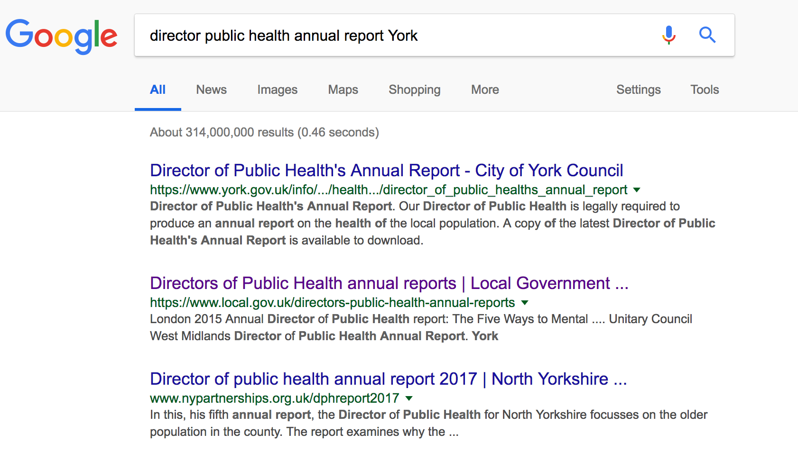

```{r setup, include=FALSE, echo=FALSE}

## Global options
knitr::opts_chunk$set(echo=TRUE,
               cache=TRUE, 
               warning = FALSE, message = FALSE)
library(pacman)
#devtools::install_github("julianflowers/myScrapers")
p_load(knitr, myScrapers, tidyverse, readtext, kableExtra, quanteda, tidytext, magrittr, text2vec, irlba, rvest, data.table, downloader)

#source("../R/googlesearchR.R")


```

# Introduction

This note describes automating the discovery, collation and analysis of annual reports of the Director of Public Health (DPH reports). DPH reports are a statutory requirement for DsPH in local authorities.^[The annual report is the DPH’s professional statement about the health of local communities, based on sound epidemiological evidence, and interpreted objectively. The report should be useful for both professionals and the public.
However it is not just the annual review of public health outcomes and activity. The annual report is an important vehicle by which DsPH can identify key issues, flag up problems, report progress and thereby
serve their local populations. It will also be a key resource to inform stakeholders of priorities and recommend actions to improve and protect the health of the communities they serve.
It will be a tool for advocacy as well as a statement of needs, current priorities and action and continuing
progress. It can also be a valuable process for internal reflection and team prioritisation as well as external
engagement and awareness raising. http://www.adph.org.uk/wp-content/uploads/2013/08/DPH-Annual-Report-guidelines.pdf]

It is motivated by:

1. The apparent lack of any central repository for DsPH reports
2. The desire to measure impact of PHE products
3. The need to base product development on user need
4. The availability of tools and techniques for automation and analysis

Our hypothesis is that DsPH reports should be an important destination for Health Intelligence products for PHE, and that priorities and themes identified through annual reports should influence and be influenced by PHE and the Health Improvement Directorate

## Methods

We have used two data science techniques - web-scraping and text analysis (natural langauge processing or NLP) - to try and create a repository of DPH annual reports which we can then analyse. 


There are 4 steps

1. **Discovery** - We need to be able to find DPH reports on the web.  
2. **Web-sraping** - if we can find reports or pages holding reports we can extract PDFs for further processing.   
3. **Cleaning and processing** - creating a 'tidy' data frame of reports, cleaning texts, adding metadata e.g. report year, local authority name  
4. **Analysis** - applying text mining and natural language processing tools to identify key themes, search for Health Intelligence products and so on.  

To make this as automated as possible, all elements of the analytical pipeline have been conducted in R, and we have written functions and scripts to facilitate the process.

## Workflow

The proposed workflow is set out below:


### What is web-scraping

Web-scraping is a technique for extracting information from websites. For example there is list of current Directors of Public Health on .GOV.UK at https://www.gov.uk/government/publications/directors-of-public-health-in-england--2/directors-of-public-health-in-england.

This list can be automatically extracted and converted to a table:

```{r, warning=FALSE}

dsph <- myScrapers::get_dsph_england()

dsph %>% write_csv("data/dsph.csv")

head(dsph, 20) %>%
  knitr::kable("html", caption = "DsPH in England") %>%
  kableExtra::kable_styling(full_width = T )

```

# Discovery

The usual approach to discovering reports would be to search Google. We have written a `googlesearchR` function which takes a search term and returns a list of links as below. We can use this to search Google for DPH reports and return the Urls directly to R. At the moment it only returns the first 100 hits.

We will create a search string for each LA and then apply `googlesearchR` to try and identify the DPH annual reports

```{r googlesearch}

dsph <- myScrapers::get_dsph_england() %>% mutate(LA = str_replace_all(LA, "UA", ""))

## clean up la list

dsph <- dsph %>% mutate(LA = str_replace(LA, "Norfolk .+", "Norfolk"),  
                        LA = str_replace(LA, "Suffolk .+", "Suffolk"), 
                        row = row_number())

las <- pull(dsph, LA)

## create search list

u <- paste("director public health annual report", las)

u[1:10]
```

## Try one search and retrieval

```{r try york}

york <- u[152]

safe_google <- safely(googlesearchR)

## pull 5 results
york_test <-purrr::map(york, ~(safe_google(.x, n= 3)))

york_test1 <- york_test %>% map(., "result") 

york_test2 <- york_test1 %>% flatten() %>% map(., 1) %>%.[1:2]

york_test1


```

The results are the same as a direct Google search



We can see that the search hasn't given us a link to a downloadable report.

In some cases, the report is further linked to from another page. We can try and read the links on this page.

```{r get-links}

get_links <- function(url){
  
  page <- read_html(url) %>%
    html_nodes("a")  %>%
    html_attr("href") 
}

york1 <- unlist(york_test1[[1]][1], as.character)

york1

safe_get_links <- safely(get_links)

york_links <- safe_get_links(york1)$result

york_links[1:20]
```

We can see that there are a few links to the DPH report. The 'downloads' one looks promising.

We have written a `get_docs` to identify PDF or docx files on web pages - we can see if there is a downloadable document at `r york_links[14]`. 

```{r get-docs}

get_docs <- function(url){
  
  page <- read_html(url) %>%
    html_nodes("a")  %>%
    html_attr("href") %>%
    .[grepl("pdf$|docx$", .)]
  
}


safe_get_docs <- safely(get_docs)

york1 <- unlist(york_test1[[1]][1], as.character)

york1

pdf_test <- map(york_links[14], ~(safe_get_docs(.x)) ) %>% map(., "result")

pdf_test


```

This reveals a link to the 2016-17 report. The next step is to download the report.

# Download

```{r download}
if(!dir.exists("dph_depot"))dir.create("dir_depot")
library(downloader)

safe_download <- safely(downloader::download)

pdf_test1 <- unlist(pdf_test)

basename(pdf_test1)

# pdfs <- map(pdf_test, "result") 

pdf_download <- download(pdf_test1, mode = "wb", destfile = basename(pdf_test1))


```

This successfully downloads the report. 

# Extract and analyse

## Reading into R

We can now read the file with `readtext` and analyse it further.

```{r single-report}

pdf_files <- list.files(pattern = ".pdf")

dph_report <- readtext(pdf_files[1])

dph_report

```

## Text analysis

We can rapidly analyse the report

```{r}

dph_report_corpus <- corpus(dph_report)

summary(dph_report_corpus)

```

This shows that the report has 153 sentences and 6765 words.

## Using a dictionary to count occurrences of key words

Going back to our original hypothesis we are interested in whether we can find references to PHE products like the public health dashboard, the PHOF, Fingertips and so on. We can create a dictionary of terms and search across all documents to count ocurrences and the estimate the proprtion of documents.

For example, for the York report we can search for: `r c(phe = "phe*", fingertips = "fingertips*", profile = "profile*", local_health = "localhealth*",  phd = "public_health_dashboard*", phof = c("phof", "outcomes_framework") )`
  
  

```{r dictionary}
dict <- dictionary(list(
  phe = "phe*", 
  fingertips = "fingertips*", 
  profile = "profile*", 
  local_health = "local*health*",
  phd = "public_health_dashboard*", 
  phof = c("phof", "outcomes_framework")))

dtm <- dfm(dph_report_corpus, remove = stopwords("en"), remove_punct = TRUE, ngrams = 1:3)

lookup <- dfm_lookup(dtm, dictionary = dict)


lookup %>% data.frame() %>%
  knitr::kable() %>%
  kableExtra::kable_styling(full_width = T )


```


There are 6 mentions of *Fingertips* and 4 of *local health*

```{r local-health}

kwic(dph_report_corpus, phrase("local health"))


```

This shows that one of the references to *local health* is to the PHE tool.

## Word cloud

```{r}
textplot_wordcloud(dtm)


```

# Scaling up

Having outlined the process, the next step is to try and identify, download and analyse reports for all 152 local authorities. The basic process is the same but there are possible additional steps.

We'll start by creating a search string in for each LA.

```{r}
la <- dsph %>% pull(LA)
search_la <- paste0("director public health report ", la,  " pdf")

search_la[1:6]
```

We can now loop over each search to find the first few hits. To do this we'll use the `googlesearchR` function from the `myScrapers` package. Initially we'll look at the first 2 hits per page.

```{r}
## test with 5 LAs

safe_google <- safely(googlesearchR)

reports <-purrr::map(search_la[1:5], ~(safe_google(.x, n= 2 )))
 
reports %>% map(., "result")

```

In some cases we can see that the search returns a link to a PDF document, and there maybe more than one report per la.

## Try for all

We'll try and download all the reports - it seems to work better in batches.

```{r search-all}

reports1 <-purrr::map(search_la[1:10], ~(safe_google(.x, n= 2 )))
reports2 <- purrr::map(search_la[11:20], ~(safe_google(.x, n= 2 )))
reports3 <- purrr::map(search_la[21:30], ~(safe_google(.x, n= 2 )))
reports4 <- purrr::map(search_la[31:40], ~(safe_google(.x, n= 2 )))
reports5 <- purrr::map(search_la[41:50], ~(safe_google(.x, n= 2 )))
reports6 <- purrr::map(search_la[51:60], ~(safe_google(.x, n= 2 )))
reports7 <- purrr::map(search_la[61:70], ~(safe_google(.x, n= 2 )))
reports8 <- purrr::map(search_la[71:80], ~(safe_google(.x, n= 2 )))
reports9 <- purrr::map(search_la[81:90], ~(safe_google(.x, n= 2 )))
reports10 <- purrr::map(search_la[91:100], ~(safe_google(.x, n= 2 )))
reports11<- purrr::map(search_la[101:110], ~(safe_google(.x, n= 2 )))
reports12<- purrr::map(search_la[111:120], ~(safe_google(.x, n= 2 )))
reports13<- purrr::map(search_la[121:130], ~(safe_google(.x, n= 2 )))
reports14 <- purrr::map(search_la[131:140], ~(safe_google(.x, n= 2 )))
reports15 <- purrr::map(search_la[141:152], ~(safe_google(.x, n= 2 )))


# reports1 <- reports1 %>% map(., "result")
# 
# names(reports1) <- las[1:50]
# names(report2) <- las[51:100]
# names(report3) <- las[101:152]


## combine all into a single list

reports_all <-c(reports1, reports2, reports3, reports4, reports5,
                reports6, reports7, reports8, reports9, reports10, reports11, reports12, reports13, reports14, reports15)

reports_all <- map(reports_all, "result")
names(reports_all) <- las

head(reports_all)

```


```{r}

link1 <- reports_all %>%
  map(., 1)

link2 <-  reports_all %>%
  map(., 2)

links <- data.frame(cbind(link1, link2)) 

library(rlist)

name <- rlist::list.names(links)
test <- rlist::list.rbind(links)

links_table <- data.frame(cbind(la = name, test = links)) %>%
  gather(report, links, 2:3) %>%
  mutate(ispdf = str_detect(links, ".pdf$"))

pdfs_table <- filter(links_table, ispdf == TRUE) %>% arrange(la)


n_dph <- length(unique(pdfs_table$name))


```

We know have a set of links to at least 1 report for `r n_dph` LAs.

`r pdfs_table %>% knitr::kable() %>%
  kableExtra::kable_styling(full_width = T )` 
 

  
## Try to download pdfs

We can try to read pdfs directly or download and then read them.

```{r}

safe_readtext <- safely(readtext)

pdfs_links <- pdfs_table %>% pull(links)

docs <- map(pdfs_links, ~(safe_readtext(.x)))
docs1 <- map(docs, "result")
docs1 <- map_df(docs1, data.frame)


```


## Corpus

```{r}

corpus_dph <- corpus(docs1)

setDT(summary(corpus_dph)) %>%
  ggplot(aes(Sentences))+
  geom_density(fill = "goldenrod") +
  govstyle::theme_gov()


```

```{r readabilty}
textstat_readability(corpus_dph, "all") 


```


```{r analysis}
dict <- dictionary(list(
  phe = "phe*", 
  fingertips = "fingertips*", 
  profile = "profile*", 
  local_health = "local*health*",
  phd = "public_health_dashboard*", 
  phof = c("phof", "outcomes_framework"), 
  mental = "mental_health", 
  cancer = "cancer",
  smoking = c("tobacco", "smok*"), 
  alcohol = c("alcohol", "drink*"), 
  sugar = "sugar*"))

dtm1 <- dfm(corpus_dph, remove = stopwords("en"), remove_punct = TRUE, ngrams = 1:3)

lookup1 <- dfm_lookup(dtm1, dictionary = dict)

topfeatures(dtm1, 30)

lookup1 %>% data.frame() %>%
  knitr::kable() %>%
  kableExtra::kable_styling(full_width = T )


```

